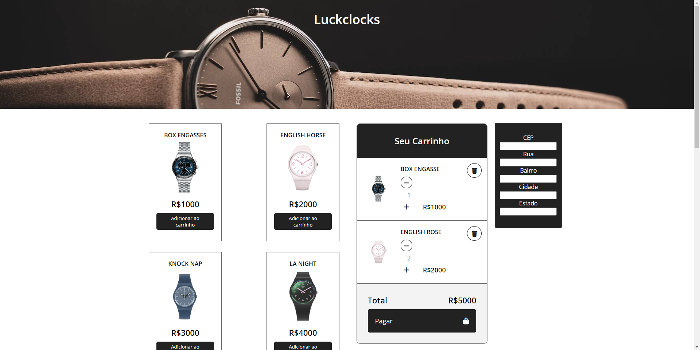

# Projeto Clock

</img>

<a href="#💻tecnologias">Tecnologias</a> | <a href="#projeto"> Projeto</a> |<a> Layout </a>|<a> Licença</a>

## 💻Tecnologias

Durante o desenvolvimento do projeto foram utilizadas as seguintes tecnologias:

- HTML5
- CSS3
- JavaScript
- API
- Git e GitHub

## Projeto

O site Clocks é uma vitrine de modelos exclusivos de relógios de Luxo , futuramente essa aplicação contará com vendas online e cadastro de clientes.

-<a> Acesse o projeto ,online </a>

#### Colaboradores

- Eduardo Silva Santa Rosa
- Iris Fernanda Celestino
- Lucas Bitencourt
- Maison Luck
